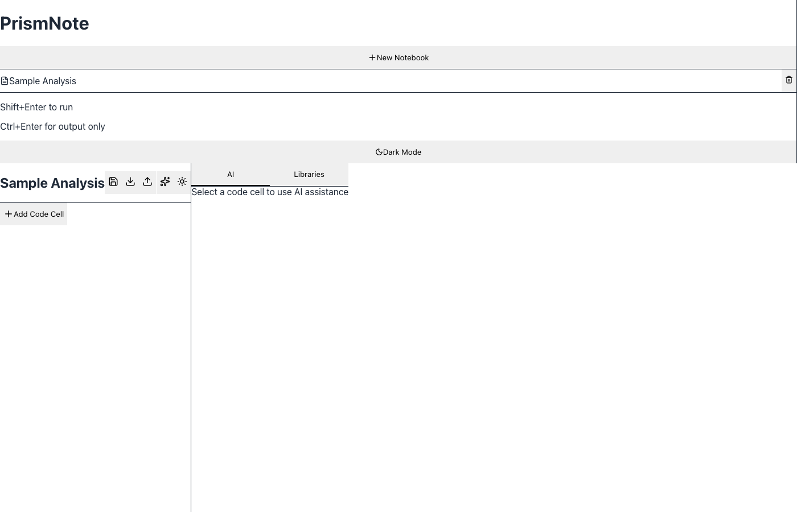

<div align="center">

# ◆ PrismNote

**The fast, local-first data-science notebook — with a warehouse-grade Data Explorer built in.**

Python + SQL · a BigQuery/Snowflake-style Data Explorer · no-code charts · local AI · jobs · git — all on your machine.

[](LICENSE)
[](https://pypi.org/project/prismnote/)
[](https://pypi.org/project/prismnote/)
[](https://www.rust-lang.org/)
[](https://github.com/Mullassery/prismnote/stargazers)

### ⭐ If PrismNote is useful to you, please [**star the repo**](https://github.com/Mullassery/prismnote) — it genuinely helps the project grow and reach more data scientists.



</div>

---

## Why PrismNote?

Jupyter is great for code, but exploring data still means writing `df.head()`, `df.describe()`,
and one-off `matplotlib` calls. PrismNote makes **data exploration a first-class surface**:
open any DataFrame — or a Parquet/CSV/Iceberg file — in a fast, scrollable grid with
per-column statistics, distributions, and lineage, then build charts with no code. It's
**local-first** (your data never leaves your machine), **Jupyter-compatible** (`.ipynb` in/out),
and **AI-native** (local via Ollama, or Claude/OpenAI).

- 🔍 **Data Explorer first** — the headline feature, ranked above the notebook itself.
- 🔒 **Local & private** — runs on your machine; local AI via Ollama, no account required.
- 🦀 **Fast** — a Rust + Axum engine driving a persistent Python kernel.
- 🔗 **Open formats** — Parquet, CSV, JSON, Arrow, **Apache Iceberg** via DuckDB.
- 🧩 **Batteries included** — kernel, SQL, charts, AI, jobs, git, deploy, search, terminal.

---

## Quickstart

Install with **pip** _or_ **uv** _or_ **curl** — pick one:

```bash
# ── pip ──
pip install prismnote && prismnote
```

— OR —

```bash
# ── uv ──  run instantly (no install), or install as a tool
uvx prismnote
#   or:  uv tool install prismnote && prismnote
```

— OR —

```bash
# ── curl ──  no Python required (installs the binary to /usr/local/bin)
curl -fsSL https://raw.githubusercontent.com/Mullassery/prismnote/main/install.sh | bash
prismnote
```

Then open **http://localhost:8000** and click **Open Data Explorer** (`⌘E`) or **New Notebook**.

> The pip/uv package is a thin launcher: on first run it downloads the prebuilt server
> binary for your platform from the matching **GitHub Release** (`vX.Y.Z`). If a release
> binary isn't published for your platform yet, use **[From source](#from-source)** below.

### From source

Requires **Rust** (stable), **Node 18+**, and **Python 3.8+** on `PATH`:

```bash
# kernel runtime deps (ipykernel required; the rest enable rich output, %sql, charts)
pip install ipykernel pandas matplotlib rich duckdb

cargo run                                   # backend  → http://localhost:8000
cd frontend && npm install && npm run dev   # frontend → http://localhost:5173
```

Open http://localhost:5173.

---

## Highlights

### 🔍 Data Explorer — better than a `df.describe()`
Open a live DataFrame, a file, or a DuckDB query in a warehouse-style explorer:

- **Virtualized grid** that scrolls millions of rows (server-side paging/sort/filter).
- **Tabs:** Preview · **Schema** (types + null %) · **Statistics** · **Metadata** · **Lineage**.
- **Per-column profiling** — histograms, top values, and a full `describe()` table
  (count, nulls, distinct, mean, std, min/quartiles/max, sum, skew, kurtosis).
- **Nested types** — `struct` and `array` columns are detected and rendered.
- **Open formats via DuckDB** — Parquet, CSV, JSON, Arrow, **Apache Iceberg**; or any DuckDB SQL.
- **Lineage** — provenance (variable / file / query), upstream sources, and the notebook
  cells that define and use the dataset.
- **Reproducible** — "Copy as code" / "Insert as cell" emits runnable pandas; export CSV.
- Collapsible, with **+/- zoom**; double-click a data file in the file browser to open it here.

### 📊 Visualization Pane
- **Plot gallery** — every figure (matplotlib/plotly) collected with zoom, pan, filmstrip,
  and **PNG + vector SVG** export.
- **No-code chart builder** (Looker-style) — drag dimensions/measures, pick a chart
  (bar/line/area/scatter/heatmap/pie), aggregate, and render via **Vega-Lite** — then
  "Copy as code" to get the equivalent Altair.

### 🤖 AI assistance
- **Choose your provider** in Settings → AI: **Ollama** (local, free, private), **Claude**,
  or **OpenAI** — with model pickers and live connection status.
- **In-cell ⌘K edit** (diff accept/reject), **Fix with AI** on errors, **Explain**.
- **Inline autocomplete** (ghost text) and a **Plan/Act agent** that's aware of your
  workspace files and the open dataset.

### 📓 Notebook & execution
- **Persistent shared kernel** — state carries across cells; interrupt & restart.
- **Magics:** `%python`, `%sql` (in-process DuckDB), `%sh` / `!cmd`, `%md`.
- **Rich output**, live-streamed over WebSocket; **input widgets** that re-run cells.
- **Auto-formatting** — code is pretty-printed with **Black** on paste and on `⇧⌥F`.
- **Friendly errors** — plain-language explanations + in-editor markers.

### 🗄️ Data & SQL
- Connect to SQLite, DuckDB, PostgreSQL, MySQL, and 8 cloud warehouses
  (Snowflake, BigQuery, Redshift, Databricks, Athena, Trino, Presto, Synapse).
- Queries run through the kernel using **permissively-licensed OSS drivers you install** —
  nothing proprietary vendored. See [CONNECTORS.md](CONNECTORS.md).

### ⚙️ Workflow
- **Jobs** — run a whole notebook on a schedule (manual / interval / daily) with run history;
  **Airflow** trigger + generated DAG.
- **Source control** — init / clone / commit / push / pull / status from the UI.
- **Cloud deploy** — generates `Dockerfile`, `docker-compose.yml`, `k8s.yaml`, `fly.toml`.

---

## How PrismNote compares

PrismNote focuses on **data exploration, local AI, and a single-binary local-first
experience**. JupyterLab, Apache Zeppelin, and PyCharm are mature, broader tools — here's
an honest side-by-side.

> ✅ built-in · ⚠️ via extension / partial / paid · ❌ not available · 🔜 on the roadmap

| Feature | PrismNote | JupyterLab | Apache Zeppelin | PyCharm (Pro) |
|---|:---:|:---:|:---:|:---:|
| Type | Notebook (web) | Notebook (web) | Notebook (web) | Desktop IDE |
| Engine / runtime | Rust + Python kernel | Python (Jupyter) | JVM + interpreters | JetBrains (JVM) + Python |
| `.ipynb` format (native) | ✅ | ✅ | ⚠️ (own format) | ✅ |
| **Built-in Data Explorer** (grid, sort/filter) | ✅ | ⚠️ | ⚠️ (basic) | ✅ (DataFrame viewer) |
| Column profiling, `describe()` & **lineage** | ✅ | ❌ | ❌ | ⚠️ (column stats) |
| Open-format explorer (Parquet/CSV/**Iceberg**) | ✅ (DuckDB) | ⚠️ (code) | ⚠️ (code) | ⚠️ (DB tools/CSV) |
| No-code chart builder | ✅ (Vega-Lite) | ❌ (code) | ✅ (on SQL) | ⚠️ (viewer charts) |
| In-process SQL (DuckDB) + magics | ✅ | ⚠️ | ✅ | ⚠️ (DB tools) |
| AI: in-cell edit / fix / explain / agent | ✅ (Ollama/Claude/OpenAI) | ⚠️ (Jupyter AI) | ❌ | ⚠️ (AI Assistant, paid) |
| AI inline autocomplete | ✅ | ⚠️ | ❌ | ✅ |
| Code auto-format (Black) | ✅ | ⚠️ | ❌ | ✅ |
| Variable explorer | ✅ | ⚠️ | ❌ | ✅ |
| Scheduled jobs (built-in) | ✅ | ❌ (external) | ✅ (cron) | ❌ |
| Git integration (UI) | ✅ | ⚠️ (jupyterlab-git) | ⚠️ | ✅ (excellent) |
| Cloud deploy artifacts (Docker/k8s/Fly) | ✅ | ❌ | ❌ | ⚠️ (plugins) |
| Real-time collaboration | 🔜 | ✅ | ⚠️ | ✅ (Code With Me) |
| Multi-language interpreters | ⚠️ (Python/SQL/shell) | ✅ (many kernels) | ✅ (many) | ⚠️ (Python focus) |
| Install | pip / uv / **single binary** | pip / conda | download + JVM | IDE download |
| License | MIT | BSD-3 | Apache-2.0 | Proprietary (Pro) |

**In short:** choose **JupyterLab** for its vast kernel/extension ecosystem and real-time
collaboration, **Zeppelin** for JVM/Spark-centric multi-interpreter workloads, **PyCharm**
for a full desktop IDE with deep refactoring and DB tools (paid Pro), and **PrismNote**
when you want fast, no-setup **data exploration + charts + local AI** in one free,
open-source local binary. See also [ZEPPELIN_COMPARISON.md](ZEPPELIN_COMPARISON.md) and
[NOTEBOOK_COMPARISON_MATRIX.md](NOTEBOOK_COMPARISON_MATRIX.md).

---

## Configure AI (optional)

**Local — Ollama** (recommended for privacy/cost):
```bash
# install from https://ollama.com, then pull a coding model
ollama pull qwen2.5-coder
# the browser UI talks to Ollama directly, so allow the origin once:
OLLAMA_ORIGINS=http://localhost:5173 ollama serve
```

**Claude / OpenAI** — set it in **Settings → AI Provider** (keys are stored locally in
`~/.prismnote/ai_config.json` and never leave your machine), or via env:
```bash
export PRISMNOTE_AI_PROVIDER=claude      # or openai / ollama
export ANTHROPIC_API_KEY=...             # or OPENAI_API_KEY
```

---

## Keyboard shortcuts

| Shortcut | Action |
|---|---|
| `⌘E` | **Open Data Explorer** |
| `⌘N` / `⌘O` / `⌘S` | New / Open / Save notebook |
| `⌘K` | Global search *(in a focused cell, `⌘K` = AI edit)* |
| `⇧⌘P` | Command palette |
| `⌘,` | Settings |
| `⌘⇧↵` / `⇧↵` | Run all / run focused cell |
| `⇧⌥F` | Format cell (Black) |

*(`⌘`/`Ctrl` depending on platform.)*

---

## Architecture

```
┌──────────────────────────────┐        ┌─────────────────────────────┐
│  React + TypeScript (Vite)   │  HTTP  │      Rust backend (Axum)    │
│  Monaco · Tailwind · zustand │ ─────▶ │  REST + WebSocket           │
│  explorer · charts · AI      │ ◀───── │  explore · jobs · git · …   │
└──────────────────────────────┘   WS   └──────────────┬──────────────┘
                                                        │ stdin/stdout (JSON)
                                                ┌───────▼────────┐
                                                │ Persistent      │
                                                │ Python kernel   │
                                                │ (shared globals)│
                                                └─────────────────┘
```

The backend spawns one long-lived `python` process and speaks a line-framed JSON
protocol; outputs are Jupyter-style MIME bundles, streamed live. The Data Explorer
pushes profiling/paging/aggregation into the kernel where the data already lives.

---

## Deploy

Open **Deploy to Cloud** to copy/download the generated artifacts, then:

```bash
docker compose up -d            # Docker
kubectl apply -f k8s.yaml       # Kubernetes
fly launch --copy-config --now  # Fly.io
```

---

## Project layout

```
crates/server/   Rust backend (api, kernel, explore, jobs, db, ws, deploy, git…)
frontend/        React app (components, hooks, api clients)
python/          PyPI launcher package (prismnote)
docs/            screenshots & comparison docs
```

Further reading: [CONNECTORS.md](CONNECTORS.md) ·
[ZEPPELIN_COMPARISON.md](ZEPPELIN_COMPARISON.md) ·
[DATABRICKS_COMPARISON.md](DATABRICKS_COMPARISON.md) ·
[NOTEBOOK_COMPARISON_MATRIX.md](NOTEBOOK_COMPARISON_MATRIX.md)

---

## Roadmap

- Prebuilt release binaries for all platforms (so `pip install` runs out of the box).
- Distributed compute (Spark) and a catalog/data browser.
- Real-time collaboration (live cursors / co-editing).
- Notebook parameters and multi-notebook job composition.
- Reactive (dependency-aware) cell execution.

---

## Contributing

⭐ **The easiest way to contribute is to [star the repo](https://github.com/Mullassery/prismnote)** — it boosts visibility and helps others discover PrismNote.

Code contributions are welcome too! Please open an issue to discuss substantial changes first.

```bash
git clone https://github.com/Mullassery/prismnote.git
cd prismnote
cargo run                                   # backend
cd frontend && npm install && npm run dev   # frontend
```

Run `cargo check` and `npm run build` before opening a PR.
See [CONTRIBUTING.md](CONTRIBUTING.md) for details.

---

## License

[MIT](LICENSE) © Georgi Mammen Mullassery
